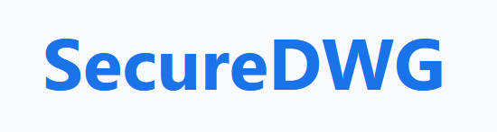

# 🔐 SecureDWG



**SecureDWG** is a secure, minimalist Google Drive interface tailored for viewing, organizing, and sharing DWG files and other documents. It is designed with a clean UX, mobile-friendly layout, and advanced features like persistent folder states and QR code sharing.

---

## 🧰 Tech Stack

- **React** (Create React App)
- **Google OAuth 2.0**
- **Google Drive API**
- **Flaticon Icons**
- **QR Code Library**
- **CSS Media Queries** for responsive design

---

## 🚀 Features

- ✅ **Google OAuth Integration**  
  Authenticate users securely using their Google accounts.

- 📂 **Drive File & Folder Browser**  
  Browse through your Google Drive files and folders with a clean interface.

- 🔄 **Persistent Folder Navigation**  
  Return to the last visited folder — even after a refresh.

- ⬆️ **Drag & Drop Uploads**  
  Upload files by dragging them directly into folders.

- 🧹 **Advanced Filtering**  
  Search and filter files with smart input, including support for file type filters.

- 🗑️ **File Deletion**  
  Quickly delete files directly from the interface.

- 📄 **Icon-Based File Previews**  
  Custom icons from Flaticon for file types: DWG, PDF, PowerPoint, Images, and more.

- 📱 **Mobile-Optimized with Bottom Nav**  
  Responsive design with a floating bottom nav for mobile users.

- 📎 **Custom Upload Buttons**  
  Intuitive file upload buttons for better UX.

- 🔗 **QR Code Generation**  
  Instantly generate QR codes to share file download links securely.

---

## 🛠️ Build and Deploy

To create a production build of the app, run:

```bash
npm run build
